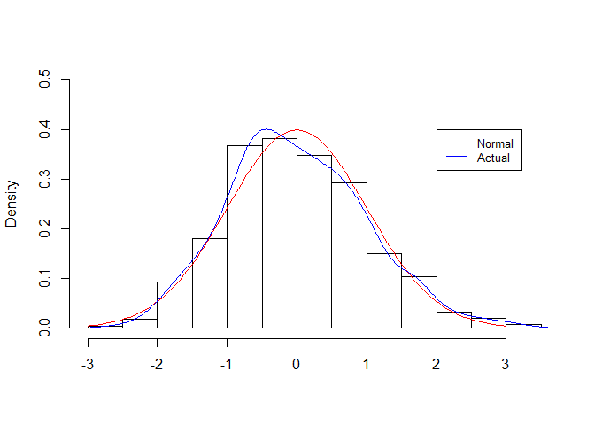

# Statistical Inference Course Project - Part 1
Chuong Hoang  
Sunday, June 14, 2015  

##Overview:
In this project we will investigate the exponential distribution in R and compare it with the Central Limit Theorem. The exponential distribution is simulated with rexp(n, lambda) where lambda is the rate parameter. Set up lambda = 0.2 for all of the simulations. We will investigate the distribution of averages of 40 exponentials under a thousand simulations.

##Simulations:
This part arm for returning a vector of 1000 mean values corresponding to thosand sample sets (40 element per sample set) of exponential distribution with lambda = 0.2. Historgram plot is used for demonstrating the distribution


```r
n <- 40       # Number of elements in one sample set
lambda <- 0.2
mns = NULL    # Initialize a vector to store thousand of extracted means
for (i in 1 : 1000) mns = c(mns, mean(rexp(n,lambda)))
hist(mns, main = "Historgram of Means of Exponential Distribution Sample Sets", xlab = "Means")
```

 

##Sample Mean versus Theoretical Mean: 

Based on the actual values of sample means vector (mns) we can calculate the mean of sample data

```r
samp_mean <- mean(mns)     # Sample mean
samp_mean
```

```
## [1] 4.973886
```

The theoretical expected value of an exponentially distributed random variable X with rate parameter lambda is given by 1/lambda

```r
theo_mean <- 1/lambda      # Theoretical mean
theo_mean
```

```
## [1] 5
```
The diference between actual and theoretical means is -0.0261

Visulization of Sample Mean versus Theoretical Mean

```r
par(mfrow=c(2,1))
hist(mns,probability=T,main=paste('Actual Mean is ',format(round(samp_mean,2),nsmall=2)),ylim=c(0,0.55),col='gray',xlab='Means of Simulation Set')
abline(v=samp_mean,col='green',lwd=5)
hist(mns,probability=T,main=paste('Theoretical Mean is ',format(round(theo_mean,2),nsmall=2)),ylim=c(0,0.55),col='gray',xlab='Means of Simulation Set')
abline(v=theo_mean,col='red',lwd=5)
```

 

##Sample Variance versus Theoretical Variance: 

Based on the actual values of sample means vector (mns) we can calculate the variance of sample data

```r
samp_var<-var(mns)             # Sample variance
samp_var
```

```
## [1] 0.627307
```

The theoretical variance value of an exponentially distributed random variable X with rate parameter lambda is given by ((1/lambda)^2)/n

```r
theo_var<-((1/lambda)^2)/n     # Theoretical variance
theo_var
```

```
## [1] 0.625
```

The diference between actual and theoretical variances is 0.0023

##Distribution: 
The actual distribution of the sample sets (blue line) is really close to the Normal Standard Distribution (red line)

```r
par(mfrow=c(1,1))
hist(scale(mns),probability=T,main='',ylim=c(0,0.5),xlab='')
curve(dnorm(x,0,1),-3,3, col='red',add=T)  # Normal distribution with mu = 0 and sd = 1
lines(density(scale(mns)),col='blue')      # Actual distribution 
legend(2,0.4,c('Normal','Actual'),cex=0.8,col=c('red','blue'),lty=1)
```

 

