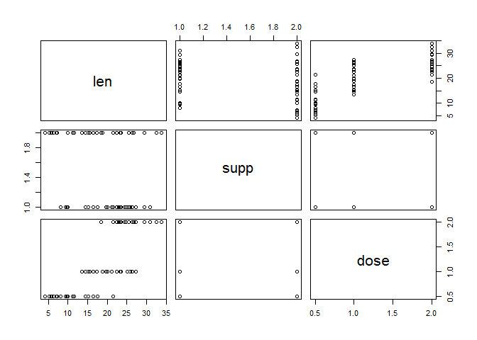
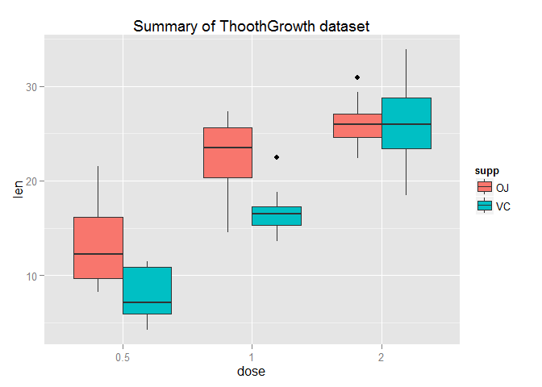

# Statistical Inference Course Project - Part 2
Chuong Hoang  
Sunday, June 21, 2015  

## Overview:
In the second part of the project, we analyze the **ToothGrowth** data in the R datasets package. The data is set of 60 observations, length of odontoblasts (teeth) in each of 10 guinea pigs at each of three dose levels of Vitamin C (0.5, 1 and 2 mg) with each of two delivery methods (orange juice or ascorbic acid).

## Data Loading:
**Load the ToothGrowth data and perform some basic exploratory data analyses**


```r
# Load the ToothGrowth dataset
library(datasets)
data(ToothGrowth)

# Overview dataset variables
str(ToothGrowth)
```

```
## 'data.frame':	60 obs. of  3 variables:
##  $ len : num  4.2 11.5 7.3 5.8 6.4 10 11.2 11.2 5.2 7 ...
##  $ supp: Factor w/ 2 levels "OJ","VC": 2 2 2 2 2 2 2 2 2 2 ...
##  $ dose: num  0.5 0.5 0.5 0.5 0.5 0.5 0.5 0.5 0.5 0.5 ...
```

The ToothGrowth data is comprised of 60 observations and 3 variables: len, supp and dose.

**Basic exploratory**
plot ToothGrowth data to have a general exploratory


```r
## Basic exploratory
plot(ToothGrowth)
```

 

In orignal dataset, the dose variable is numeric. But based on characteristic of dose variables demontrating in the third column of the plot, There is only 3 levels of Vitamin C (0.5, 1 and 2 mg). As a result of the basic exploratory, it is neccessary to convert dose to factor.


```r
# Convert ToothGrowth$dose from numeric to factor
ToothGrowth$dose <- as.factor(ToothGrowth$dose)

# Review the structure of dataset
str(ToothGrowth)
```

```
## 'data.frame':	60 obs. of  3 variables:
##  $ len : num  4.2 11.5 7.3 5.8 6.4 10 11.2 11.2 5.2 7 ...
##  $ supp: Factor w/ 2 levels "OJ","VC": 2 2 2 2 2 2 2 2 2 2 ...
##  $ dose: Factor w/ 3 levels "0.5","1","2": 1 1 1 1 1 1 1 1 1 1 ...
```

## Data Summary:
**Provide a basic summary of the data.**


```r
# Summary the ToothGrowth dataset
summary(ToothGrowth)
```

```
##       len        supp     dose   
##  Min.   : 4.20   OJ:30   0.5:20  
##  1st Qu.:13.07   VC:30   1  :20  
##  Median :19.25           2  :20  
##  Mean   :18.81                   
##  3rd Qu.:25.27                   
##  Max.   :33.90
```

```r
# Visualize the ToothGrowth dataset summary
library(ggplot2)
ggplot(data = ToothGrowth, aes(x = dose, y = len, fill = supp)) + geom_boxplot() + ggtitle("Summary of ThoothGrowth dataset")
```

 

The graphical demonstration revals a clear positive correlation between the tooth length and the dose levels of Vitamin C, for both delivery methods: orange juice (OJ) and ascorbic acid (VC).

## Analyze:
Author use hypothesis tests to compare tooth growth by supp and dose.

Considering unequal variances between 2 suppelement groups (`var.equal = FALSE`). We use t.test with default confidence level is .95. We check if there's difference in the performance of the treatments, looking if the p value>0.05 and if the confidence interval contains 0


```r
g1 <- ToothGrowth[ToothGrowth$supp=="OJ","len"]
g2 <- ToothGrowth[ToothGrowth$supp=="VC","len"]
t.test(g1, g2, paired = FALSE, var.equal = FALSE)
```

```
## 
## 	Welch Two Sample t-test
## 
## data:  g1 and g2
## t = 1.9153, df = 55.309, p-value = 0.06063
## alternative hypothesis: true difference in means is not equal to 0
## 95 percent confidence interval:
##  -0.1710156  7.5710156
## sample estimates:
## mean of x mean of y 
##  20.66333  16.96333
```

As the p-value of this test is 0.06, we have not enough evidence to reject the null hypothesis, which subsequently means that we cannot assume that the means of delivery of the vitamin has any effect on tooth length.


```r
# We will test of the tooth length of the group with vitamin C dosage
g1 <- ToothGrowth[ToothGrowth$dose==2,"len"]
g2 <- ToothGrowth[ToothGrowth$dose==1,"len"]
t.test(g1, g2, paired = FALSE, var.equal = TRUE)
```

```
## 
## 	Two Sample t-test
## 
## data:  g1 and g2
## t = 4.9005, df = 38, p-value = 1.811e-05
## alternative hypothesis: true difference in means is not equal to 0
## 95 percent confidence interval:
##  3.735613 8.994387
## sample estimates:
## mean of x mean of y 
##    26.100    19.735
```

We have enough evidence to reject the null hypothesis, which subsequently means that we can assume that the means of dosage change from 1mg to 2mg creates an positive effect on tooth length.


```r
g1 <- ToothGrowth[ToothGrowth$dose==1,"len"]
g2 <- ToothGrowth[ToothGrowth$dose==0.5,"len"]
t.test(g1, g2, paired = FALSE, var.equal = TRUE)
```

```
## 
## 	Two Sample t-test
## 
## data:  g1 and g2
## t = 6.4766, df = 38, p-value = 1.266e-07
## alternative hypothesis: true difference in means is not equal to 0
## 95 percent confidence interval:
##   6.276252 11.983748
## sample estimates:
## mean of x mean of y 
##    19.735    10.605
```

We have enough evidence to reject the null hypothesis, which subsequently means that we can assume that the means of dosage change from 0.5mg to 1mg creates an positive effect on tooth length.

The confidence interval does not contain zero. There's no need to compare the groups of vitamin C dosage of 0.5 and 2mg, given the result of the two previous test.

## Conclusions and Assumptions:

**Assumptions:** 

There's a common variance in the guinea pigs population (`var.equal=TRUE`). The experiment design suggest that each Guinea pig was randomly assigned to a combination of dosage and supplement type, so the test that we performed used the independent samples methodology.

**Conclusions:**

1. Supplement type has no effect on tooth growth.
2. Inreasing the dose level leads to increased tooth growth.
